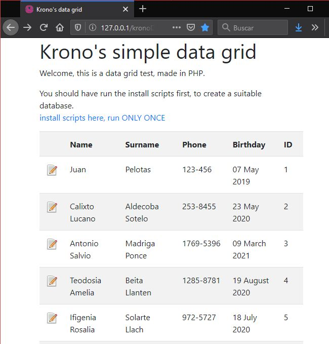

# Krono's PHP data grid

Version 1.0.0 - March 2020

## Screenshoot

## Introduction

Hello, Alvaro 'Krono' here!

I needed a lightweight data grid for some commercial projects, and all were very bloated and expensive, so I developed this super light weight data grid.

Useful things in this project:
1. A data grid with editable tools, kronoDataGrid.php, very light weight
2. A RANDOM name and surname generator for your projects, in install/index.php and supporting files.
3. A very lightweight MySQL connect wrapper. Check connectMySQL.php

You dont need bloated code to be productive.

Thanks for checking my code.

## Credits

Copyright (c) 2013, 2020, Krono from Argentina.

Thanks to all my family, friends, and UADE fellow students.

## Donations

If you find my code useful and want to donate, here is my address:

**TODO** - put btc address here

## Usage

FIRST: edit **dbConfig.php** and setup your MySQL user, password, database.

SECOND: run **once** the **/install/index.php** script to generate the tables and random data. Also check the useful algorithm + dataset to generate random clients, is very useful to populate test databases.

All the interesting stuff happens inside **lib/kronoDataGrid.php** ; check that file to see how it works.

To do the test you need a PHP, web and database MySQL server, running locally or remotely.

For example, Apache, PHP and MySQL bundle in Linux or Windows.

Remember to edit 'dbConfig.php' to set up your database user, password and host.

After setting up the database, go to 'install/' folder in your browser to setup the database.

The install scripts will fill the database with random generated data, suitable for the test.

Then you are ready to test the data grid.

## Contributing

Just write on my GitHub with any contributions.

## License MIT

MIT License

Copyright (c) 2013-2020, Alvaro 'Krono' Gonzalez Ferrer

Permission is hereby granted, free of charge, to any person obtaining a copy
of this software and associated documentation files (the "Software"), to deal
in the Software without restriction, including without limitation the rights
to use, copy, modify, merge, publish, distribute, sublicense, and/or sell
copies of the Software, and to permit persons to whom the Software is
furnished to do so, subject to the following conditions:

The above copyright notice and this permission notice shall be included in all
copies or substantial portions of the Software.

THE SOFTWARE IS PROVIDED "AS IS", WITHOUT WARRANTY OF ANY KIND, EXPRESS OR
IMPLIED, INCLUDING BUT NOT LIMITED TO THE WARRANTIES OF MERCHANTABILITY,
FITNESS FOR A PARTICULAR PURPOSE AND NONINFRINGEMENT. IN NO EVENT SHALL THE
AUTHORS OR COPYRIGHT HOLDERS BE LIABLE FOR ANY CLAIM, DAMAGES OR OTHER
LIABILITY, WHETHER IN AN ACTION OF CONTRACT, TORT OR OTHERWISE, ARISING FROM,
OUT OF OR IN CONNECTION WITH THE SOFTWARE OR THE USE OR OTHER DEALINGS IN THE
SOFTWARE.
